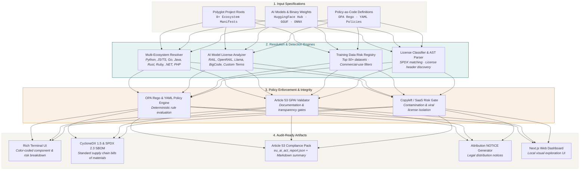

<div align="center">
  <picture>
    <source media="(prefers-color-scheme: dark)" srcset="https://raw.githubusercontent.com/aiexponent/license-compliance-checker/main/.github/brand/og-license-compliance-checker-dark.png">
    <source media="(prefers-color-scheme: light)" srcset="https://raw.githubusercontent.com/aiexponent/license-compliance-checker/main/.github/brand/og-license-compliance-checker-light.png">
    
  </picture>
  <h1 align="center">License Compliance Checker (LCC)</h1>
  <p align="center"><em>Know what you ship. Know what you owe.</em></p>
  <p align="center">
    <a href="https://pypi.org/project/license-compliance-checker/"></a>
    <a href="https://github.com/aiexponent/license-compliance-checker/actions"></a>
    <a href="https://aiexponent.github.io/license-compliance-checker/"></a>
    <a href="LICENSE"></a>
    <a href="https://www.python.org/downloads/"></a>
    <a href="https://eur-lex.europa.eu/legal-content/EN/TXT/?uri=CELEX:32024R1689"></a>
    <a href="#privacy"></a>
  </p>
</div>

---

> **License Compliance Checker automates Software Composition Analysis (SCA), CycloneDX/SPDX SBOM generation, AI model licensing detection, and EU AI Act Article 53 compliance packs. Apache 2.0, AS IS.**
>
> LCC turns multi-ecosystem software licensing, foundation model licensing, and GPAI transparency into an automated developer workflow and CI gate. LCC is an engineering automation tool; it is **not** legal counsel and does not constitute a formal legal compliance determination.

---

## The Problem

On **August 2, 2025**, the statutory obligations for providers of General-Purpose AI (GPAI) models under Article 53 of the EU AI Act ([Regulation (EU) 2024/1689](https://eur-lex.europa.eu/legal-content/EN/TXT/?uri=CELEX:32024R1689)) entered into active legal enforcement across all 27 EU member states.

Providers and deployers of GPAI models face mandatory statutory requirements to maintain technical documentation, publish detailed summaries of content used for training, and respect EU copyright and licensing laws.

* **Statutory Enforcement Date**: GPAI model obligations under Article 53 became enforceable on **2 August 2025**.
* **Statutory Non-Compliance Penalties**: Fines up to **€35,000,000 or 7% of total worldwide annual turnover**.
* **The Compliance Blind Spot**: Traditional Software Composition Analysis (SCA) tools only inspect standard package manifests (`package.json`, `requirements.txt`). They are completely blind to Hugging Face model weights, local GGUF/ONNX binary weights, and training datasets with restrictive non-commercial or academic-only terms (e.g. RAIL, Llama Community License, OpenRAIL).

**License Compliance Checker (LCC)** resolves the software supply chain and AI provenance gap directly in your terminal and CI/CD pipeline:

> *"Do we know the exact licensing terms, commercial restrictions, and Article 53 compliance obligations of every open-source dependency, AI model weight, and dataset in our AI software stack?"*

Audit your polyglot codebases across 8+ ecosystems and analyze AI models in under 60 seconds, completely offline, with zero telemetry.

Built by [AI Exponent LLC](https://aiexponent.com). Apache 2.0. Runs entirely offline after `pip install`.

---

## Quick Start

```bash
pip install license-compliance-checker
```

```bash
# 1. Quick project scan (multi-ecosystem dependencies)
lcc scan .

# 2. Scan with EU AI Act Article 53 compliance policy
lcc scan . --policy eu-ai-act-compliance --format json

# 3. Scan AI models & binary weights (Hugging Face Hub, GGUF, ONNX)
lcc scan . --scan-models

# 4. Generate an industry-standard CycloneDX or SPDX SBOM
lcc sbom generate scan-report.json --format cyclonedx --output sbom.json

# 5. Check GPL / copyleft contamination in a SaaS context
lcc scan . --project-license Apache-2.0 --context saas
```

<p align="center">
  
</p>

---

## Why LCC

| Evaluation Method | Cost | Turnaround | AI Model & Dataset Awareness | Offline / Zero-Telemetry? |
| :--- | :--- | :--- | :--- | :--- |
| **Big 4 IP Advisory** | €50K–€200K per audit¹ | 4–8 Weeks | ❌ No (Advisory opinion only) | ❌ No (NDAs & data sharing) |
| **Legacy SCA Platforms** | $20K–$80K/year¹ | Days | ❌ No (Package-only manifests) | ❌ No (Transfers source/SBOM to cloud) |
| **Manual Spreadsheet Audits** | "Free" | Weeks | ⚠️ Error-prone & incomplete | ⚠️ Manual |
| **License Compliance Checker** | **Free (Apache 2.0)** | **< 60 seconds** | **✅ Yes (HuggingFace, GGUF, ONNX, RAIL)** | **✅ Yes (100% offline, zero network)** |

<sup>¹ Indicative market figures gathered from public legal advisory retainers and enterprise SCA pricing pages. Not a formal benchmark; figures vary by code volume, model count, and jurisdiction.</sup>

---

## System Architecture

LCC operates as a deterministic, offline static-analysis and policy-enforcement pipeline:



---

## What LCC Does

- **Multi-Ecosystem SCA**: Scans dependencies across Python (`pip`, `poetry`), JavaScript/TypeScript (`npm`, `yarn`, `pnpm`), Go, Java (`Maven`, `Gradle`), Rust (`Cargo`), Ruby (`Bundler`), .NET (`NuGet`), and PHP (`Composer`).
- **AI Model & Weight License Detection**: Resolves Hugging Face Hub model licenses, detects local binary weights (`.gguf`, `.onnx`), and flags restrictive license variants (RAIL, OpenRAIL, Llama Community License).
- **EU AI Act Article 53 GPAI Assessment**: Evaluates general-purpose AI models against Article 53 statutory transparency, technical documentation, and training summary requirements.
- **Training Data Risk Registry**: Pre-configured catalog of 50+ widely-used AI training datasets flagged for commercial-use limitations and attribution requirements.
- **Dual SBOM Generation**: Produces industry-standard Software Bills of Materials in both CycloneDX v1.5 and SPDX v2.3 formats.
- **Policy-as-Code Engine**: Write declarative compliance rules in YAML or expressive Open Policy Agent (OPA) Rego.
- **Zero Network Calls (Offline Guarantee)**: Local filesystem and AST analysis with zero external telemetry and zero data leakage.

---

## Supported Export Formats

LCC produces industry-standard Software Composition Analysis (SCA), SBOM, and regulatory compliance artifacts:

| Format | Standard / Specification | Output File / Target | Primary Use Case |
|---|---|---|---|
| **CycloneDX** | CycloneDX v1.5 (JSON / XML) | `sbom.json` / `sbom.xml` | Enterprise Software Bill of Materials (SBOM) ingestion |
| **SPDX** | SPDX v2.3 (JSON / Tag-Value) | `spdx.json` / `spdx.spdx` | Open-source supply chain verification & NTIA compliance |
| **Article 53 Compliance Pack** | EU AI Act GPAI Spec (JSON / MD) | `eu_ai_act_report.json` | Regulatory filing & conformity evidence under Regulation (EU) 2024/1689 |
| **JSON** | Native LCC Schema | `scan-report.json` | CI/CD automation, programmatic analysis, and dashboard ingestion |
| **HTML** | Self-contained Report | `report.html` | Human-readable executive audits & sharing with stakeholders |
| **Markdown** | Standard GFM | `report.md` | PR summaries, documentation, and repository tracking |
| **CSV** | Tabular Spreadsheet | `report.csv` | Procurement, spreadsheet analysis, and legal inventory reviews |
| **Attribution NOTICE** | Apache / Open-Source Standard | `NOTICE` | Distribution compliance and automated third-party license notices |

> [!NOTE]
> **SARIF Export Clarification**: LCC generates Software Composition Analysis (SCA) data, SBOMs, and regulatory compliance packs. It does **not** generate SARIF (Static Analysis Results Interchange Format) output, as SARIF is designed for static source code defect / flaw reporting. For SARIF-based EU AI Act compliance screening, see [LitmusAI](https://github.com/aiexponent/litmusai) (Article 5 Prohibited Practices Screener).

---

## Interactive Artifact Previews

<details>
  <summary><b>📄 View Starter <code>lcc.yml</code> Policy Configuration</b></summary>

```yaml
version: "1.0"
project:
  name: "ai-service-platform"
  license: "Apache-2.0"
  distribution: "saas"

policies:
  # Prohibit viral copyleft in commercial SaaS
  prohibited_licenses:
    - "GPL-2.0-only"
    - "GPL-3.0-only"
    - "AGPL-3.0-only"

  # Allowed permissive licenses
  allowed_licenses:
    - "Apache-2.0"
    - "MIT"
    - "BSD-2-Clause"
    - "BSD-3-Clause"
    - "ISC"

  # AI Model & Data Policy
  ai_governance:
    enforce_article_53: true
    allow_non_commercial_models: false
    flag_unresolved_weights: true
```
</details>

<details>
  <summary><b>🔍 View CycloneDX 1.5 SBOM Output (JSON)</b></summary>

```json
{
  "$schema": "http://cyclonedx.org/schema/bom-1.5.schema.json",
  "bomFormat": "CycloneDX",
  "specVersion": "1.5",
  "serialNumber": "urn:uuid:3e4567e8-9b12-4d34-a456-426614174000",
  "version": 1,
  "metadata": {
    "timestamp": "2026-09-22T12:00:00Z",
    "tools": [
      {
        "vendor": "AiExponent LLC",
        "name": "license-compliance-checker",
        "version": "2.0.1"
      }
    ],
    "component": {
      "type": "application",
      "name": "ai-service-platform",
      "version": "1.0.0"
    }
  },
  "components": [
    {
      "type": "library",
      "name": "fastapi",
      "version": "0.111.0",
      "purl": "pkg:pypi/fastapi@0.111.0",
      "licenses": [
        {
          "license": {
            "id": "MIT"
          }
        }
      ]
    },
    {
      "type": "machine-learning-model",
      "name": "mistralai/Mistral-7B-Instruct-v0.3",
      "version": "v0.3",
      "purl": "pkg:huggingface/mistralai/Mistral-7B-Instruct-v0.3",
      "licenses": [
        {
          "license": {
            "id": "Apache-2.0"
          }
        }
      ]
    }
  ]
}
```
</details>

<details>
  <summary><b>📊 View EU AI Act Article 53 Compliance Pack (JSON)</b></summary>

```json
{
  "statutory_reference": "Regulation (EU) 2024/1689, Article 53",
  "compliance_target": "General-Purpose AI (GPAI) Model Documentation",
  "generated_at": "2026-09-22T12:00:00Z",
  "generator": "license-compliance-checker 2.0.1",
  "verdict": "COMPLIANT",
  "summary": {
    "dependencies_scanned": 142,
    "ai_models_detected": 2,
    "datasets_audited": 3,
    "policy_violations": 0
  },
  "article_53_checks": {
    "technical_documentation_available": true,
    "copyright_compliance_policy_documented": true,
    "training_data_summary_provided": true,
    "license_compatibility_verified": true
  },
  "ai_assets": [
    {
      "name": "mistralai/Mistral-7B-Instruct-v0.3",
      "type": "model_weights",
      "source": "Hugging Face Hub",
      "license": "Apache-2.0",
      "commercial_use_permitted": true
    }
  ]
}
```
</details>

---

## CI/CD Integration & Exit Codes

Integrate LCC into your GitHub Actions workflow as an automated pull request compliance gate:

```yaml
# .github/workflows/license-compliance.yml
name: License & AI Compliance Gate
on: [pull_request, push]

jobs:
  license-gate:
    runs-on: ubuntu-latest
    steps:
      - uses: actions/checkout@v4
      - uses: actions/setup-python@v5
        with:
          python-version: "3.12"
      - run: pip install license-compliance-checker
      - name: Run LCC Scan
        run: lcc scan . --policy .github/policies/corporate-policy.yml --format json --output compliance-report.json
      - name: Generate CycloneDX SBOM
        run: lcc sbom generate compliance-report.json --format cyclonedx --output sbom.json
      - uses: actions/upload-artifact@v4
        with:
          name: compliance-artifacts
          path: |
            compliance-report.json
            sbom.json
```

### Exit Code Contract

LCC implements deterministic UNIX exit codes for scripting, pre-commit hooks, and CI gates:

| Exit Code | Meaning | CI Gate Behavior |
| :--- | :--- | :--- |
| `0` | **COMPLIANT** | All dependencies, AI models, and training datasets satisfy configured compliance policies. |
| `1` | **POLICY VIOLATION** | Prohibited license detected (e.g. AGPL in SaaS context, non-commercial restrictions in production). |
| `2` | **CONFIG / INPUT ERROR** | Malformed policy YAML/Rego file, missing target directory, or invalid CLI parameters. |
| `3` | **REVIEW REQUIRED** | Compound license expressions (`AND`/`OR`) or ambiguous custom licenses requiring human review. |

---

## CLI Command Reference

| Command | Usage | Description |
|---|---|---|
| `lcc scan` | `lcc scan [PATH] [OPTIONS]` | Scan repository dependencies, AI models, and training data against policies. |
| `lcc sbom generate` | `lcc sbom generate [INPUT] [OPTIONS]` | Generate CycloneDX v1.5 or SPDX v2.3 Software Bills of Materials. |
| `lcc policy validate` | `lcc policy validate [POLICY_FILE]` | Validate custom YAML or OPA Rego policy files for syntax and completeness. |
| `lcc report export` | `lcc report export [SCAN_REPORT] [OPTIONS]` | Export scan results into HTML, Markdown, CSV, or NOTICE attribution files. |
| `lcc auth` | `lcc auth [login/logout/token]` | Manage API keys for registries, GitHub, and Hugging Face Hub access. |
| `lcc server` | `lcc server --host [HOST] --port [PORT]` | Launch local FastAPI backend to power the Next.js compliance dashboard. |
| `lcc --version` | `lcc --version` | Display the installed LCC version and environment info. |

---

## AI Model & Dataset License Detection

LCC goes beyond standard package manifests (`package.json`, `requirements.txt`) to inspect the AI assets that actually govern your models:

### HuggingFace Models

LCC resolves HuggingFace models referenced in code or configuration by querying the HuggingFace Hub API. It detects:

- Open-source permissive licenses: Apache-2.0, MIT, BSD
- Restrictive/responsible AI licenses: RAIL, OpenRAIL, BigCode OpenRAIL-M
- Proprietary/commercial terms: Llama 2/3 Community License, Mistral Research License
- Non-commercial restrictions: CC-BY-NC-4.0

```bash
# Scan a repo that uses HuggingFace models
lcc scan . --scan-models

# Scan a specific HuggingFace model directly
lcc scan-model meta-llama/Llama-3-8B-Instruct
```

### Local Model Files

LCC identifies model weights stored locally in your repository:

- GGUF files (`.gguf`) — extracts embedded metadata including license strings
- ONNX models (`.onnx`) — parses graph metadata for model provenance
- PyTorch/Safetensors (`.bin`, `.safetensors`) — pairs with companion `config.json`

---

## EU AI Act Article 53 Compliance

Under Article 53 of the EU AI Act (Regulation (EU) 2024/1689), providers of general-purpose AI (GPAI) models must:

1. Put in place a policy to comply with Union copyright law
2. Draw up and make publicly available a sufficiently detailed summary about the content used for training

LCC assesses your repository against these requirements and generates a compliance pack:

```bash
lcc scan . --policy eu-ai-act-compliance --format json --output eu-compliance.json
```

The output includes:

- Verification of copyright compliance policies in your repo
- Model training data provenance assessment
- Flagged training datasets with known copyright or licensing risks
- Ready-to-file documentation for downstream deployers and regulators

---

## Training Data Risk Registry

LCC includes a curated registry of commonly used AI training datasets and their commercial use status:

| Dataset | Primary License | Commercial Use | Risk Level |
|---|---|---|---|
| Common Crawl | Terms of Use / Mixed | Requires review | Medium |
| LAION-5B | CC-BY-4.0 (metadata only) | Permitted with attribution | Medium |
| ImageNet | Non-commercial research only | Prohibited | High |
| Books3 / The Pile | Copyrighted content / Takendown | Prohibited | Critical |
| RedPajama | Mixed (per-source) | Permitted for vetted subsets | Low-Medium |
| Dolma | OpenRAIL / Mixed | Permitted with restrictions | Low |

---

## Policy-as-Code with OPA Rego

Define your organization's license policies using Open Policy Agent (OPA) Rego or simple YAML rules:

```rego
package lcc.policy

default allow = false

# Allow permissive licenses
allow {
    input.license.type == "permissive"
}

# Block copyleft in proprietary projects
deny[msg] {
    input.project.type == "proprietary"
    input.license.copyleft == true
    msg := sprintf("Copyleft license %v is prohibited in proprietary projects", [input.license.spdx_id])
}

# Require attribution for AI models
warn[msg] {
    input.component.type == "ai-model"
    not input.component.has_attribution
    msg := sprintf("AI model %v missing required attribution", [input.component.name])
}
```

```bash
# Run with a custom policy
lcc scan . --rego-policy ./policies/corporate.rego
```

---

## Monorepo & Multi-Language Support

LCC automatically discovers and parses manifests across polyglot repositories:

| Language/Ecosystem | Files Detected |
|---|---|
| Python | `pyproject.toml`, `setup.py`, `requirements.txt`, `Pipfile`, `poetry.lock` |
| JavaScript/TypeScript | `package.json`, `package-lock.json`, `yarn.lock`, `pnpm-lock.yaml` |
| Go | `go.mod`, `go.sum` |
| Java/Kotlin | `pom.xml`, `build.gradle`, `build.gradle.kts` |
| Rust | `Cargo.toml`, `Cargo.lock` |
| Ruby | `Gemfile`, `Gemfile.lock` |
| .NET | `*.csproj`, `packages.config` |
| PHP | `composer.json`, `composer.lock` |

---

## Web Dashboard

For teams that prefer a visual interface, LCC includes a local Next.js web dashboard:

```bash
git clone https://github.com/aiexponent/license-compliance-checker
cd license-compliance-checker
docker-compose up -d
```

Open `http://localhost:3000` to explore scan results, dependency trees, and policy violations.

---

## Known Limitations

- HuggingFace Hub API scanning requires referenced model IDs (not local downloads only).
- SPDX `AND`/`OR` compound expressions are flagged for manual review, not auto-resolved.
- Transitive dependency resolution requires a lock file (`poetry.lock`, `package-lock.json`).
- Article 53 assessment covers documentation completeness only — not a legal compliance determination.
- Training data risk registry covers top-50 known datasets; unknown datasets flagged for review.

---

## Documentation

Full documentation is available on the live [Material for MkDocs Documentation Portal](https://aiexponent.github.io/license-compliance-checker/):

- **[Getting Started & Quick Start](https://aiexponent.github.io/license-compliance-checker/getting-started/quickstart/)** — Setup guide, first project scan, and SBOM generation.
- **[Installation Guide](https://aiexponent.github.io/license-compliance-checker/getting-started/installation/)** — Package managers (`pip`, `uv`), container installation, and requirements.
- **[User Guide & CLI Manual](https://aiexponent.github.io/license-compliance-checker/guides/user/)** — Comprehensive command-line flags, scanners, and report generators.
- **[Policy Guide (Rego & YAML)](https://aiexponent.github.io/license-compliance-checker/guides/policies/)** — Authoring custom policies, OPA rules, and compliance gates.
- **[API Reference & Schemas](https://aiexponent.github.io/license-compliance-checker/reference/api/)** — Python SDK, FastAPI endpoints, and schema definitions.
- **[Deployment & Dashboard Guide](https://aiexponent.github.io/license-compliance-checker/deployment/)** — Production checklists, Docker deployment, and web dashboard access.
- **[Troubleshooting & FAQ](https://aiexponent.github.io/license-compliance-checker/reference/faq/)** — Common questions, licensing nuances, and SARIF non-support rationale.
- **[Testing Guide](https://aiexponent.github.io/license-compliance-checker/guides/testing/)** — Running the automated test suite and integration test environments.

---

## Releases

| Version | Highlights |
|---|---|
| **[v2.0.1](https://github.com/aiexponent/license-compliance-checker/releases/tag/v2.0.1)** | Hard-gated type checking in CI (0 errors across 99 files), Python 3.13 matrix, live Material for MkDocs portal, 8-format Supported Export Formats, reciprocal 5-tool ecosystem footer, flat-square badges & Dependabot. |
| [v2.0.0](https://github.com/aiexponent/license-compliance-checker/releases/tag/v2.0.0) | Major release: OPA Rego policy engine, EU AI Act Article 53 compliance packs, CycloneDX 1.5 & SPDX 2.3 SBOM generation, AI model & GGUF/ONNX detection. |
| [v1.0.0](https://github.com/aiexponent/license-compliance-checker/releases/tag/v1.0.0) | Initial release of multi-ecosystem dependency license scanner. |

---

## Contributing

See [CONTRIBUTING.md](CONTRIBUTING.md). Issues and PRs welcome.

```bash
git clone https://github.com/aiexponent/license-compliance-checker
cd license-compliance-checker
pip install -e ".[dev]"
pytest
```

---

## Privacy & Zero-Telemetry Guarantee

<a name="privacy"></a>

License Compliance Checker operates completely locally and offline with **zero telemetry**, no usage tracking, and no external reporting. Your dependency graphs, policies, proprietary codebases, and compliance packs remain strictly on your local infrastructure.

---

## License

[Apache 2.0](LICENSE) — free to use, modify, and distribute.

Built by [AI Exponent LLC](https://aiexponent.com) — `hello@aiexponent.com`

---

*Part of the AiExponent open-source AI governance toolchain:*  
[litmusai](https://github.com/aiexponent/litmusai) (Art. 5) · 
**license-compliance-checker** (Art. 53) · 
[rag-benchmarking](https://github.com/aiexponent/rag-benchmarking) (Art. 15) · 
[riskforge](https://github.com/aiexponent/riskforge) (Art. 9) · 
[agentic-document-analyser](https://github.com/aiexponent/agentic-document-analyser) (Art. 9 / Annex IV)

---

<div align="center">
  <sub>
    <a href="https://aiexponent.com">aiexponent.com</a> ·
    <a href="mailto:hello@aiexponent.com">hello@aiexponent.com</a> ·
    Built in the open · Apache 2.0
  </sub>
</div>
